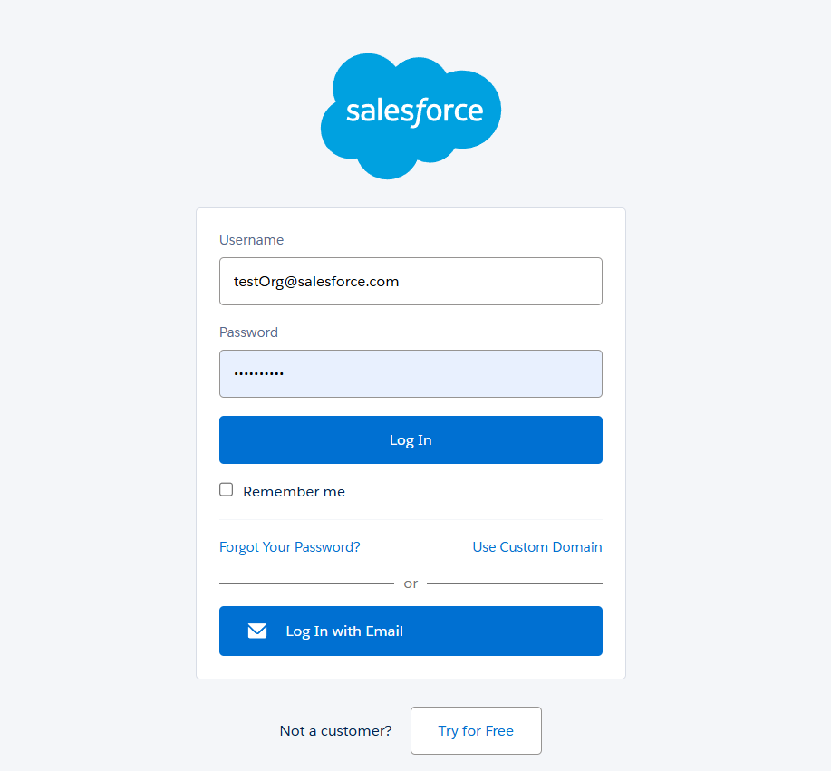
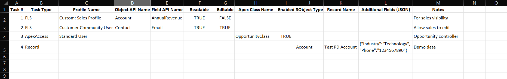
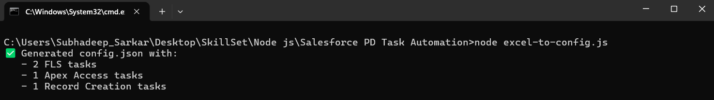
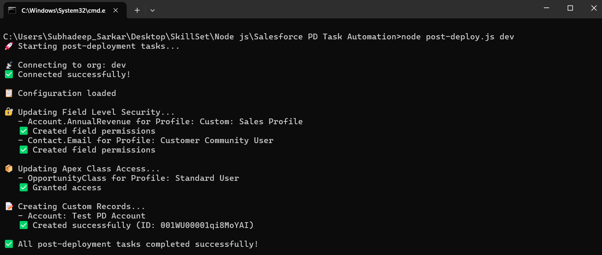

# Salesforce Post-Deployment Automation Tool

Automate repetitive post-deployment tasks in Salesforce including Field Level Security (FLS), Apex Class Access, and Custom Record creation.

---

## 📋 Table of Contents

- [Overview](#overview)
- [Prerequisites](#prerequisites)
- [Installation](#installation)
- [Usage Guide](#usage-guide)
  - [Step 1: Authenticate to Salesforce](#step-1-authenticate-to-salesforce)
  - [Step 2: Fill the Excel Template](#step-2-fill-the-excel-template)
  - [Step 3: Convert Excel to JSON](#step-3-convert-excel-to-json)
  - [Step 4: Run Post-Deployment Tasks](#step-4-run-post-deployment-tasks)
- [Excel Template Guide](#excel-template-guide)
- [Troubleshooting](#troubleshooting)
- [Contributing](#contributing)

---

## 🎯 Overview

This tool automates common Salesforce post-deployment tasks that cannot be migrated through Flosum or other deployment tools:

- **Field Level Security (FLS)**: Set field permissions for profiles
- **Apex Class Access**: Grant or revoke Apex class access for profiles
- **Custom Records**: Create configuration or test records

---

## ✅ Prerequisites

Before using this tool, ensure you have:

- **Node.js** (v18 or higher) - [Download here](https://nodejs.org/)
- **Salesforce CLI** - [Installation guide](https://developer.salesforce.com/docs/atlas.en-us.sfdx_setup.meta/sfdx_setup/sfdx_setup_install_cli.htm)
- **Access** to the target Salesforce org with appropriate permissions
- **Microsoft Excel** or **Google Sheets** (for editing the template)

---

## 🚀 Installation

### 1. Clone or Download the Repository
```bash
git clone https://github.com/CR-Samrat/Salesforce-PD-Task-Automation.git
cd salesforce-post-deploy
```

### 2. Install Dependencies
```bash
npm install
```

This will install:
- `@salesforce/core` - For Salesforce authentication and API calls
- `jsforce` - For simplified Salesforce operations
- `xlsx` - For Excel file processing

---

## 📖 Usage Guide

### Step 1: Authenticate to Salesforce

Before running the tool, authenticate to your target Salesforce org using the Salesforce CLI.
```bash
sf org login web --alias <your-org-alias>
```

**Example:**
```bash
sf org login web --alias production
```

This will open a browser window for you to log in to Salesforce.

**Screenshot:**



> **Note:** You only need to do this once per org. The authentication is stored locally and reused.

---

### Step 2: Fill the Excel Template

1. Open the Excel template: `post-deploy-tasks.xlsx`
2. Fill in your post-deployment tasks in the **Tasks** sheet

**Template Structure:**

| Task # | Task Type | Profile Name | Object API Name | Field API Name | Readable | Editable | Apex Class Name | Enabled | SObject Type | Record Name | Record Type | Additional Fields (JSON) | Notes |
|--------|-----------|--------------|-----------------|----------------|----------|----------|-----------------|---------|--------------|-------------|-------------|-------------------------|-------|
| 1 | FLS | System Administrator | Account | AnnualRevenue | TRUE | FALSE | | | | | | | Sales visibility |
| 2 | ApexAccess | System Administrator | | | | | AccountController | TRUE | | | | | Core controller |
| 3 | Record | | | | | | | | Account | Test Account | Customer | {"Industry":"Technology"} | Demo data |

**Task Types:**

- **FLS**: Field Level Security
  - Required columns: Profile Name, Object API Name, Field API Name, Readable, Editable
  
- **ApexAccess**: Apex Class Access
  - Required columns: Profile Name, Apex Class Name, Enabled
  
- **Record**: Custom Record Creation
  - Required columns: SObject Type, Record Name
  - Optional: Record Type, Additional Fields (JSON)

**Screenshot:**



> **Tip:** Use the Instructions sheet in the Excel file for detailed examples and guidelines.

---

### Step 3: Convert Excel to JSON

Once you've filled the Excel template, convert it to the `config.json` file that the tool uses.
```bash
node excel-to-config.js
```

**Screenshot:**



> **Note:** This will overwrite the existing `config.json` file. Review the generated file to ensure accuracy.

**Generated config.json example:**
```json
{
  "fieldLevelSecurity": [
    {
      "object": "Account",
      "field": "AnnualRevenue",
      "profile": "Custom: Sales Profile",
      "readable": true,
      "editable": false
    },
    {
      "object": "Contact",
      "field": "Email",
      "profile": "Customer Community User",
      "readable": true,
      "editable": true
    }
  ],
  "apexClassAccess": [
    {
      "className": "OpportunityClass",
      "profile": "Standard User",
      "enabled": true
    }
  ],
  "customRecords": [
    {
      "sObject": "Account",
      "data": {
        "Name": "Test PD Account",
        "Industry": "Technology",
        "Phone": "1234567890"
      }
    }
  ]
}
```

---

### Step 4: Run Post-Deployment Tasks

Execute the post-deployment automation script:
```bash
node post-deploy.js <your-org-alias>
```

**Example:**
```bash
node post-deploy.js production
```

**Screenshot:**



---

## 📊 Excel Template Guide

### Sheet: Tasks (Main)

This is where you define all your post-deployment tasks.

#### Column Definitions:

| Column | Required For | Description | Valid Values |
|--------|--------------|-------------|--------------|
| Task # | All | Task reference number | Any number |
| Task Type | All | Type of task to perform | FLS, ApexAccess, Record |
| Profile Name | FLS, ApexAccess | Salesforce profile name | Exact profile name from org |
| Object API Name | FLS | Object API name | Account, Contact, Custom__c, etc. |
| Field API Name | FLS | Field API name | Name, Email, Custom_Field__c, etc. |
| Readable | FLS | Can users read this field? | TRUE, FALSE |
| Editable | FLS | Can users edit this field? | TRUE, FALSE |
| Apex Class Name | ApexAccess | Apex class name | AccountController, etc. |
| Enabled | ApexAccess | Grant or revoke access | TRUE, FALSE |
| SObject Type | Record | Object to create record in | Account, Contact, Custom__c, etc. |
| Record Name | Record | Name field value | Any text |
| Record Type | Record | Type/RecordType value (optional) | Customer, Partner, etc. |
| Additional Fields (JSON) | Record | Extra fields as JSON (optional) | {"Industry":"Tech","Phone":"123"} |
| Notes | All | Your notes (optional) | Any text |

#### Examples:

**Example 1: Field Level Security**
```
Task #: 1
Task Type: FLS
Profile Name: System Administrator
Object API Name: Account
Field API Name: AnnualRevenue
Readable: TRUE
Editable: FALSE
Notes: Allow admins to view revenue but not edit
```

**Example 2: Apex Class Access**
```
Task #: 2
Task Type: ApexAccess
Profile Name: Custom: Sales Profile
Apex Class Name: OpportunityService
Enabled: TRUE
Notes: Sales team needs access to opportunity service
```

**Example 3: Custom Record**
```
Task #: 3
Task Type: Record
SObject Type: Account
Record Name: Demo Account
Record Type: Customer
Additional Fields (JSON): {"Industry":"Technology","Phone":"555-0100"}
Notes: Demo data for training
```

### Sheet: Instructions

Contains detailed instructions and examples. Refer to this sheet when filling the template.

---

## 🔧 Troubleshooting

### Issue: "Org not found" or Authentication Error

**Solution:**
```bash
# List all authenticated orgs
sf org list

# Re-authenticate if needed
sf org login web --alias your-org-alias
```

---

### Issue: "Profile 'X' not found"

**Solution:**
- Verify the exact profile name in Salesforce (Setup → Profiles)
- Profile names are case-sensitive
- Include any prefixes like "Custom: " for custom profiles

---

### Issue: "Field 'X.Y' not found"

**Solution:**
- Use the API name, not the label
- For custom fields, include the `__c` suffix
- Format: `ObjectAPIName.FieldAPIName` (e.g., `Account.AnnualRevenue`)

---

### Issue: Excel conversion fails

**Solution:**
```bash
# Ensure xlsx package is installed
npm install xlsx

# Check that your Excel file is named correctly
# Default expected: post-deploy-tasks.xlsx
```

---

### Issue: Self-signed certificate errors (Corporate proxy)

**Solution:**
If you're behind a corporate proxy with SSL inspection, the `@salesforce/core` package should handle this automatically. If issues persist, contact your IT department for the corporate SSL certificate.

---

### Issue: "Parent ID: id value of incorrect type"

**Solution:**
This error means the tool is trying to use a Profile ID instead of a Permission Set ID. This should be handled automatically in the current version. If you see this error:
1. Ensure you're using the latest version of the code
2. Verify the profile exists in your org
3. Check the Salesforce logs for more details

---

## 🤝 Contributing

### Reporting Issues

If you encounter any issues:
1. Check the [Troubleshooting](#troubleshooting) section first
2. Create a detailed issue report with:
   - Steps to reproduce
   - Error messages (full output)
   - Your environment (Node version, OS, Salesforce org type)

### Suggesting Improvements

Have ideas for improvement? We'd love to hear them! Please:
1. Open an issue describing your suggestion
2. If you can, submit a pull request with your changes

---

## 📝 Project Structure
```
salesforce-post-deploy/
├── README.md                    # This file
├── package.json                 # Node.js dependencies
├── post-deploy.js              # Main automation script
├── excel-to-config.js          # Excel to JSON converter
├── post-deploy-tasks.xlsx      # Excel template (user fills this)
├── config.json                 # Generated config (DO NOT EDIT MANUALLY)
├── screenshots/                # Documentation screenshots
│   ├── step1-authentication.png
│   ├── step2-excel-template.png
│   ├── step3-conversion.png
│   └── step4-execution.png
└── node_modules/

---

## 👤 Author

Created by [Subhadeep]
For questions or support, contact: [thehitmansubhadeepsarkar@gmail.com]

---

## 🙏 Acknowledgments

- Built using [@salesforce/core](https://www.npmjs.com/package/@salesforce/core)
- Excel processing via [xlsx](https://www.npmjs.com/package/xlsx)
- Inspired by the need to simplify post-deployment tasks for the Salesforce team